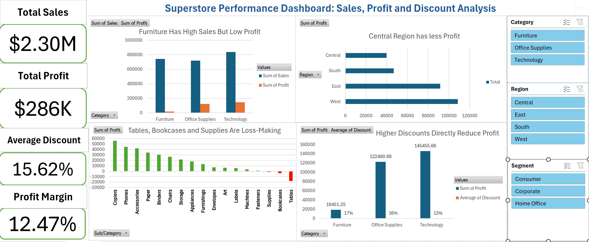

# 🛒 Retail Profitability Analysis — Superstore Dataset

> Uncovering what drives profit (and loss) in a retail business using Excel — from raw messy data to a clean, interactive dashboard.

---

## 📸 Dashboard Preview



---

## 🧹 Data Cleaning

The raw dataset had several issues that had to be fixed before any analysis could begin.

### 📅 Wrong Date Formats — Order Date & Ship Date
Both date columns were stored as **plain text**, not actual dates. This made sorting, filtering, and time-based grouping completely unreliable, with mixed formats like `MM/DD/YYYY` and `DD-MM-YYYY` in the same column.

**Fix:** Loaded the data into **Power Query**, changed column types to `Date` with locale-aware parsing, and reloaded the cleaned table back into Excel.

### 💰 Inconsistent Number Formatting — Discounts & Profit Margins
The `Discount` and `Profit` columns had inconsistent number formats — some values were stored as plain text, others as unformatted decimals with no consistency in decimal places. This meant Excel wasn't recognizing them as numbers, breaking any calculations or aggregations built on top of them.

**Fix:** Selected both columns and used **Format Cells → Number** to enforce a consistent numeric format. Discount values were standardized to percentage format and Profit Margin figures were rounded to 2 decimal places using `ROUND()` to ensure clean, reliable aggregation across pivot tables.

### ➕ New Calculated Columns
After cleaning, I added columns to enable richer analysis:

| Column            | Logic                          | Purpose                             |
|-------------------|--------------------------------|-------------------------------------|
| `Profit Margin %` | `Profit / Sales × 100`         | `Spot high vs low profitability`    |
| `Delivery Days`   | `Ship Date − Order Date`       | `Measure fulfillment speed`         |
| `Profit/Loss`     | `IF(Profit > 1,"Profit","Loss"`| `To seperate profit and loss items` |
---

## 📊 Key Insights

**💻 Technology was the most profitable category**
Consistently high margins across sub-categories like Phones and Accessories made Technology the clear winner in profitability.

**🪑 Furniture was losing money**
Despite strong sales volume, sub-categories like Tables and Bookcases ran at a net loss — driven by heavy discounting and high shipping costs.

**🌍 West region led in total sales**
The West outperformed all other regions in revenue, but margin analysis revealed it wasn't the most *efficient* region.

**🏷️ Deep discounts destroyed profit margins**
Orders with discounts above 30% frequently resulted in negative profit. The data clearly showed that discount strategy needed tightening.

---

## 🛠 Tools Used

| Tool | Purpose |
|---|---|
| Microsoft Excel | Pivot tables, charts, dashboard |
| Power Query | Date formatting & data type fixes |
| Excel Formulas | `TEXT`, `AVERAGE`,`TEXT`, `IF`, `SUM` for cleaning & calculated columns |

---

## 📁 Repository Structure

```
superstore-sales-analysis-excel/
│
├── Dashboard.png                           # Dashboard screenshot
├── Sample - Superstore.xlsx                # Cleaned workbook + dashboard
├── Superstore_Analytics_Presentation.pptx
└── README.md
```

---

## 👤 Author

**Vishnu Reddy**  
[GitHub @YVR-1020](https://github.com/YVR-1020)
